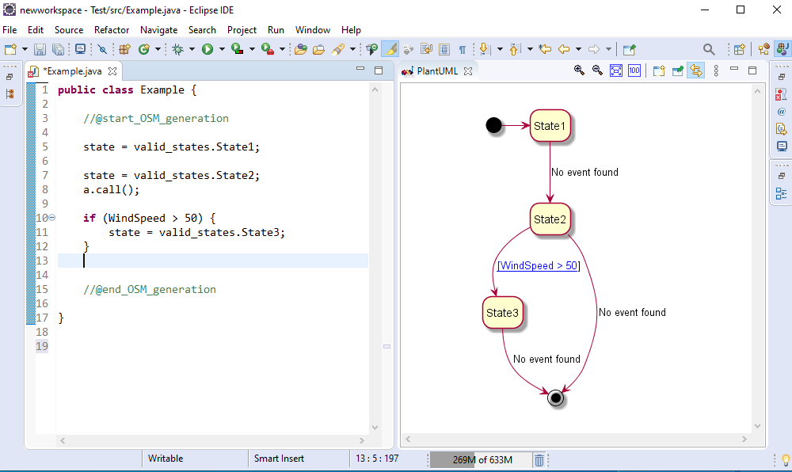

# UML State Machines as Annotations for State-based Software
A dissertation project contributing to my BSc degree at The University of Sheffield. It outlines the design and implementation of a plugin for the Eclipse IDE which extends a well known tool called PlantUML https://plantuml.com/, enhancing its ability to annotate state-based software.

*The plugin is writen 100% in Java*.

# Introduction

The goal behind the plugin made in this project is to simplyify the complexities developers face when attempting to understand state-based code, whether their aim is to extend it, write tests for it, or simply adapt it. Within the confinements of this project this has been accomplished in a variety of ways:

* Automatic generation of a state-machine diagram based on state-based code. 
* Linking between components in a diagram and lines of code (and vice versa) via navigation (see below).

Below, an overview of the results and uses of the plugin will be illustrated. For a substantially more detailed examination that stretches from research into exisiting tools, all the way to the design and implementation of the plugin, see the attached thesis 'Annotations_of_Software.pdf'.

# The plugin

## <div align="center"> Automatic Generation of a Diagram </div>

Undeniably, the most useful feature of the plugin is the automatic generation of a state machine diagram when given state-based code. The generated diagram appears in a view within Eclipse next to the text editor for the users convenience:

<br>
<div align = "center">
  
</div>
<br>

As shown, this provides the developer with an easy way to comprehend the code they are writing/reading within the same environment.

As can be seen in the figure above, state declerations must be prefaced with 'valid_states'. *It should be noted that this is the only requirement the user must satisfy within their code to enable the diagrammatic generation to occur.* 

### Functionality 

The plugin provides the functionality of inferring the following programming practices:

* Conditionals (guards)
* Actions
* Switch statements
* While loops

### Conditionals

As shown previously, simple if statements can be detected. Additionally, if/else and if/else if/ else statements can also be implied:

#### If/Else

<br>
<div align = "center">
  
</div>
<br>

#### If/Else if*/Else

<br>
<div align = "center">
  
</div>
<br>

I'm sure you're thinking - what if some of this hypothetical systems behaviour is guarded behind a plethora of nested conditionals? Utilizing a tree structure and a fairly complex algorithm for traversal, the plugin is able to autonomously generate a diagram which accurately depicts the logic:

<br>
<div align = "center">
  
</div>
<br>

### Actions 

As well as inferring guards the plugin can also detect actions, which taken in the context of state machines, essentially means method calls that affect an objects behaviour. For instance, if the system encapsulated an autopilot for a plane and the method was called to alter the rudder roatation, it would be known as an action. 

To detect an action, the method decleration simply needs to be inserted within the auto-generation statements (@start_OSM_generation). Then, whenever the method is called within the flow of the system it will be inferred appropriately:

<br>
<div align = "center">
  
</div>
<br>

### Switch statements

As these are commonplace within state-based systems it made sense to provide the functionality to infer them. In order to do so (and to ensure consistency) you must use the variable 'state' as the variable you switch like so:

<br>
<div align = "center">
  
</div>
<br>

### While loops

Again, loops are an integral component of state-based systems as behaviour is often constantly monitored. See below the same system as shown under the 'action' header but this time with a while loop around states 1 and 2:

<br>
<div align = "center">
  
</div>
<br>

*Note: There are no requirements for this piece of functionality.*

### Removing undesired inference

Like with any software there is bound to be bugs. Although rare, this is particually true with this plugin because various assumptions must be made. To overcome this, there are built-in commands to remove unwanted inference. 

To remove a state entirely (along with all transitions flowing in/out):
```
  //FSM: REMOVE - stateName
```
To remove a single transition:
```
  //FSM: REMOVE - state -> anotherState : thelabel
```

## <div align="center"> Linking between diagram and code </div>

It is undeniable that reading state-based code and thereafter comprehending it can be a challenging task. While a diagram representing the system (such as a state-machine) may be available to the developer, releating components such as states and transitions to the sections of the code they depict can be difficult. For this reason, it was clear that any plugin made to enhance comprehension of state-based code should tackle this problem head on. 

The solution used in this plugin is to automatically construct bi-directional links between both the components of the generated state-machine and the code it represents. The final implementation allows users to click on a component in a state-machine to be directed to the line of code which describes it. In a similar way, if the user clicks on a line of code that describes a component, they will be navigated to the component (i.e a state) via it being highlighted. 

To demonstrate this functionality the following simple state-machine will be used:

<br>
<div align = "center">
  
</div>
<br>

### Linking between states
The following is the result of clicking on the State1 component in the diagram:

<br>
<div align = "center">
  
</div>
<br>

As shown the users cursor is navigated to the line declaring the state and it is highlighted blue.

Now shown is the result of clicking on that same line:

<br>
<div align = "center">
  
</div>
<br>

As you can see State1 is highlighted to reinforce that this state relates to the line just selected.

### Linking between transitions

The following is the result of clicking on the transition component between State1 and State2:

<br>
<div align = "center">
  
</div>
<br>

This time the transition (the guard) is highlighted green so the user can easily differentiate between states and transitions. Note also that the state that is guarded by the transition is highlighted.

Now shown is the result of clicking on the same line highlighted above:

<br>
<div align = "center">
  
</div>
<br>

Like before, the component (this time the transition), is highlighted in the diagram. 


# Installation

PlantUML for Eclipse must be installed - http://hallvard.github.io/plantuml/

This plugin also requires GraphViz to be installed, you can install this here - https://graphviz.org/download/. You must then link the dot executable to Eclipse via the PlantUML preference page. 

Then simply install my plugin - statemachine.generation.site

To generate a diagram you must insert the state-based code between the following statements:

@start_OSM_generation
//Insert code here
@end_OSM_generation

*OSM in this context stands for Object state machine*

Then, if the PlantUML view is open in Eclispe, a diagram will be automatically generated for you.


